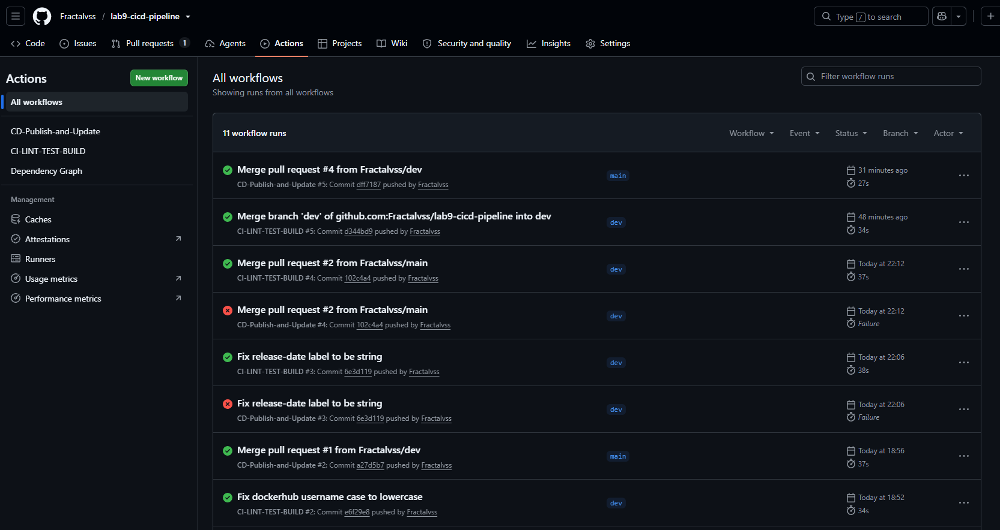
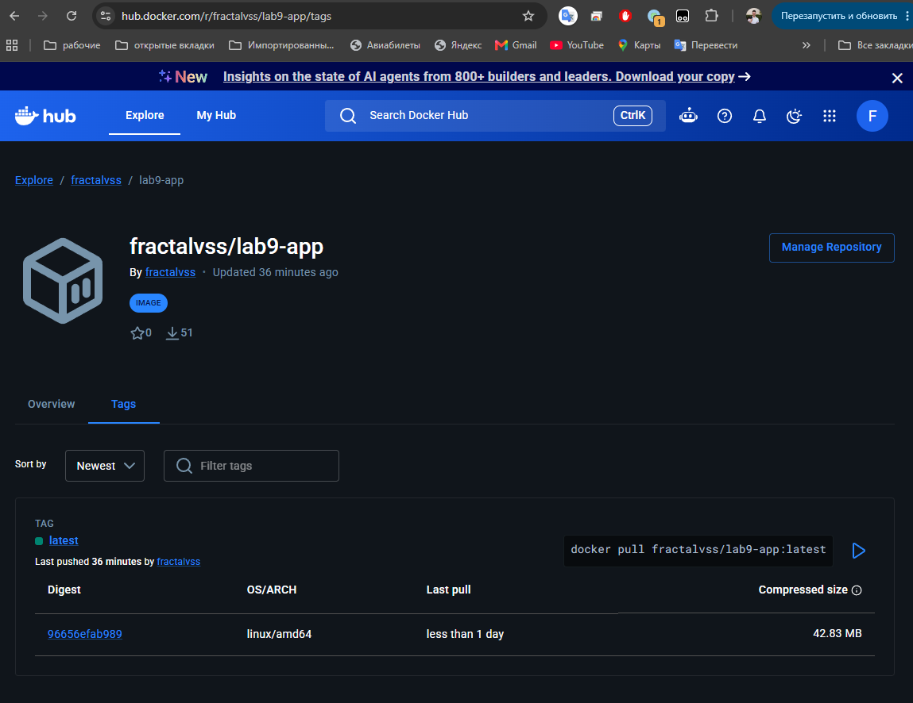
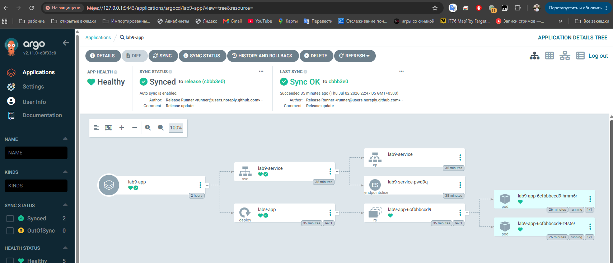
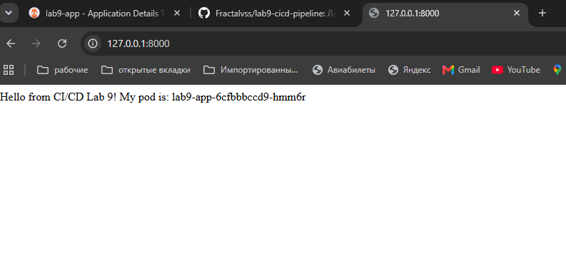

# Лабораторная работа 9. Приложение и CI/CD-пайплайн/
Настройка полного CI/CD цикла для Cloud-native приложения с использованием:
- **GitHub Actions** - для непрерывной интеграции (CI) и доставки (CD)
- **Docker Hub** - хранилище контейнерных образов
- **Kubernetes (Minikube)** - оркестрация контейнеров
- **ArgoCD** - GitOps continuous delivery

## Задача

Разработать автоматизированный пайплайн, который:
1. При коммите в ветку `dev` запускает линтинг, тесты и сборку
2. При мерже в `main` собирает Docker-образ и публикует его в Docker Hub
3. ArgoCD автоматически синхронизирует изменения из ветки `release` в Kubernetes кластер

## Структура репозитория

```
lab9-cicd/
+-- .github/
¦   L-- workflows/
¦       +-- cicd.yml           # CI пайплайн (lint, test, build)
¦       L-- cd.yml             # CD пайплайн (docker build, push, update manifests)
+-- k8s-manifests/
¦   +-- deployment.yml         # Kubernetes Deployment
¦   L-- service.yml            # Kubernetes Service (NodePort)
+-- server/
¦   +-- app.py                 # Flask приложение
¦   +-- test_app.py            # Юнит-тесты (pytest)
¦   +-- dockerfile             # Dockerfile для сборки образа
¦   L-- requirements.txt       # Python зависимости
L-- README.md
```

## Как запустить

### Предварительные требования

- GitHub аккаунт
- Docker Hub аккаунт
- Kubernetes кластер (Minikube)
- ArgoCD установлен в кластере

### Настройка секретов GitHub

В репозитории GitHub настроить Secrets (Settings > Secrets and variables > Actions):

- `DOCKER_USERNAME` - логин Docker Hub
- `DOCKER_TOKEN` - Personal Access Token Docker Hub

### Локальный запуск приложения

```bash
# Сборка образа
cd server
docker build -t lab9-app .

# Запуск контейнера
docker run -d -p 8000:8000 --name lab9-app lab9-app

# Проверка
curl http://localhost:8000
```

## CI/CD Workflow

### Веточная модель

```
dev          > разработка, CI пайплайн (lint/test/build)
  v merge
main         > стабильная версия, CD пайплайн (build/push)
  v force push
release      > ArgoCD отслеживает эту ветку
  v sync
Kubernetes   > автоматический деплой
```

### Этапы пайплайна

**CI Pipeline (`.github/workflows/cicd.yml`):**
1. **Lint** - проверка кода pylint
2. **Unit Tests** - запуск pytest
3. **Build Test** - сборка Docker образа и интеграционный тест

**CD Pipeline (`.github/workflows/cd.yml`):**
1. **Push to Registry** - сборка и публикация образа в Docker Hub
2. **Update Manifests** - обновление даты релиза в k8s манифестах
3. **Commit to Release** - пуш изменений в ветку `release`

### ArgoCD

ArgoCD настроен на отслеживание ветки `release`:
- Автоматическая синхронизация при изменении манифестов
- Self-healing - восстановление состояния при дрейфе конфигурации
- Визуализация состояния приложения через WebUI

## Результат

После успешного выполнения пайплайна:

- Docker образ опубликован: `fractalvss/lab9-app:latest`  
- ArgoCD показывает статус **Synced** и **Healthy**  
- Приложение доступно по NodePort  
- При изменении кода - автоматический деплой новой версии

## Проверка работы

```bash
# Проверка подов
kubectl get pods -l app=lab9-app

# Проверка сервиса
kubectl get svc lab9-service

# Доступ к приложению
minikube tunnel --bind-address 10.0.2.3
curl http://127.0.0.1:8000

# Просмотр логов ArgoCD
kubectl logs -n argocd -l app.kubernetes.io/name=argocd-server
```

## Скриншоты

### GitHub Actions - успешный пайплайн


### Docker Hub - опубликованный образ


### ArgoCD - приложение в статусе Healthy


### Работающее приложение

